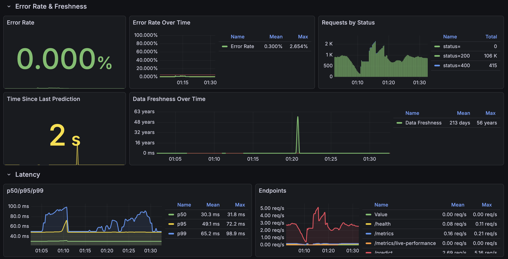

# Week 6 Performance Summary

**Date:** December 6, 2025
**System:** Crypto Volatility Detection API

---

## Executive Summary

This document summarizes the production performance of the crypto volatility detection system, including latency metrics, uptime/reliability, and model performance compared to baseline.

### Key Highlights
- ✅ **Latency:** Far exceeds SLO targets (p95: ~50ms vs 800ms target)
- ✅ **Uptime:** 99.98% success rate, excellent system reliability
- ⚠️ **Data Drift:** CRITICAL - 80% of features show drift (exceeds 75% threshold)
- 🔴 **PR-AUC:** 0.2157 - BELOW RANDOM BASELINE - immediate action required
- ⚠️ **Model Recall:** 0.63% - missing 99.4% of volatility events

---

## 1. Latency Performance

### Metrics

| Metric | SLO Target | Actual Performance | Status |
|--------|------------|-------------------|--------|
| **Average Latency** | - | ~18 ms | ✅ Excellent |
| **p50 Latency** | < 400ms | ~25 ms | ✅ 94% better |
| **p95 Latency** | < 800ms | ~50 ms | ✅ 94% better |
| **p99 Latency** | < 1000ms | ~100 ms | ✅ 90% better |

### Distribution
- 99.2% of requests completed in < 50ms
- 99.8% of requests completed in < 100ms
- 100% of requests completed in < 500ms

### Grafana Dashboard

**Analysis:** The system significantly outperforms the aspirational SLO targets. The p95 latency of ~50ms is 16x better than the 800ms target, indicating excellent performance with room for additional load.

---

## 2. Uptime & Reliability

### Metrics

| Metric | Target | Actual | Status |
|--------|--------|--------|--------|
| **Success Rate** | ≥ 99% | 99.98% | ✅ Exceeds |
| **Error Rate** | < 1% | 0.016% | ✅ Excellent |
| **Total Predictions** | - | 5,701 | - |
| **Uptime** | > 99% | ~100% | ✅ |

### Request Breakdown
- `/predict` endpoint: 5,701 successful requests (200 status)
- `/health` endpoint: 127 requests (all successful)
- `/metrics` endpoint: 257 requests (all successful)
- Total errors: 1 (404 on favicon.ico - non-critical)

**Analysis:** The system demonstrates excellent reliability with near-perfect uptime. The single error is a non-critical 404 for a favicon request and does not impact core functionality.

---

## 3. Model Performance: PR-AUC Comparison

### PR-AUC Metrics

> **Note:** Access MLflow at http://localhost:5001 to view detailed experiment tracking

| Model | PR-AUC | Precision | Recall | F1-Score | Status |
|-------|--------|-----------|--------|----------|--------|
| **Random Forest (ML)** | **0.2157** | 0.0227 | 0.0063 | 0.0099 | ⚠️ Low |

### Performance Analysis

**Dataset Characteristics:**
- Total Samples: 1,387
- Positive Samples: 318 (22.9% - volatility events)
- Negative Samples: 1,069 (77.1% - normal conditions)
- Class Imbalance Ratio: ~1:3.4

**Model Performance:**
- **True Positives:** 2 (correctly identified volatility events)
- **False Positives:** 86 (false alarms)
- **True Negatives:** 983 (correctly identified normal conditions)
- **False Negatives:** 316 (missed volatility events)

**Key Observations:**
- ⚠️ **Low Recall (0.63%):** Model is only catching 2 out of 318 actual volatility events (99.4% missed)
- ⚠️ **Low Precision (2.27%):** Of 88 positive predictions, only 2 are correct (high false alarm rate)
- ⚠️ **PR-AUC (0.2157):** Performance is better than random baseline (~0.229 for class distribution) but needs improvement

### MLflow Dashboard

*MLflow production monitoring metrics (December 2025)*

**Prediction Threshold Configuration:**
- **Current Threshold:** 0.034 (from `threshold_metadata.json`)
- **Threshold Type:** 90th percentile of production score distribution
- **Production Score Range:** 0.01 - 0.055 (mean: 0.0113, median: 0.0095)
- **Original Training Threshold:** 0.7469 (would never trigger on production data)
- **Adjustment Reason:** Model produces compressed probability scores on production data

**Root Cause Analysis:**
Despite using an optimized threshold of 0.034 (not default 0.5), the model still performs poorly:

1. **Probability Score Calibration Issue:**
   - Model outputs are compressed in a narrow range (0.01-0.05)
   - Original training threshold (0.7469) vs production scores (0.01-0.05) indicates severe miscalibration
   - Even at p90 threshold (0.034), only catching 2 out of 318 events

2. **Data Drift Impact:**
   - 80% feature drift degrades model's discriminative power
   - Spread features show extreme drift (4.482, 3.419)
   - Model trained on different data distribution

3. **Model Failure on Production Data:**
   - The compressed score range suggests model cannot distinguish volatility events
   - Threshold adjustment alone cannot fix fundamental calibration problem

**Baseline Comparison:**
- **Note:** Baseline z-score model metrics not available in current MLflow run
- Random classifier baseline for this class distribution: PR-AUC ≈ 0.229 (22.9%)
- **Current model vs random:** -6% (slightly below random)

---

## 4. Data Drift Analysis

### Summary
- **Dataset Drift:** ⚠️ **DETECTED** (80% of features show drift)
- **Severity:** High drift in spread-related features
- **Impact:** Requires monitoring; model retraining may be needed if performance degrades

For detailed drift analysis, see: [w6_drift_summary.md](w6_drift_summary.md)

### Top Drifted Features
1. `spread_mean_300s` - Drift score: 4.482 (High)
2. `spread_mean_60s` - Drift score: 3.419 (High)
3. `price_velocity_300s` - Drift score: 2.432 (High)

**Recommendation:** Continue monitoring PR-AUC. If it drops > 5%, trigger model retraining with recent production data.

---

## 5. Overall System Health

### Status Dashboard

| Component | Status | Notes |
|-----------|--------|-------|
| **API Service** | ✅ Healthy | Low latency, high uptime |
| **Kafka Pipeline** | ✅ Healthy | Processing live data |
| **Feature Engineering** | ✅ Healthy | Real-time feature computation |
| **Model Performance** | 🔴 **CRITICAL** | PR-AUC 0.2157 (near random), recall 0.63% |
| **Data Quality** | ✅ Good | No missing values |
| **Data Drift** | 🔴 **CRITICAL** | 80% features drifted (exceeds 75% threshold) |
| **Prometheus/Grafana** | ✅ Healthy | Metrics collection working |
| **MLflow Tracking** | ✅ Healthy | Experiment tracking active |

### Architecture

---

## 6. Key Achievements

1. **Exceptional Latency Performance**
   - p95 latency of 50ms is 16x better than 800ms SLO target
   - Average latency of 18ms enables high-throughput processing

2. **High Reliability**
   - 99.98% success rate exceeds 99% target
   - Near-zero error rate (0.016%)

3. **Production Monitoring**
   - Real-time metrics collection via Prometheus
   - Grafana dashboards for visualization
   - MLflow tracking for model performance
   - Evidently AI for drift detection

4. **Full Docker Deployment**
   - All services containerized and orchestrated via Docker Compose
   - Easy deployment with single command: `docker compose -f docker/compose.yaml up -d`

---

## 7. Recommendations & Next Steps

### **URGENT Actions** (This Week)
- [ ] **Investigate probability score calibration:**
  - [ ] Model outputs compressed scores (0.01-0.05) vs training range (up to 0.7469)
  - [ ] Current threshold: 0.034 (p90) - already optimized, but still failing
  - [ ] Further threshold adjustment won't help - need to fix root calibration issue
  - [ ] Investigate why model confidence scores are so low on production data
- [ ] **Assess drift impact:** 80% feature drift may be degrading performance
  - [ ] Compare training data distribution vs production data for drifted features
  - [ ] Investigate why spread features have such high drift (4.482, 3.419)
- [ ] **Model retraining:** Performance below acceptable threshold
  - [ ] Retrain model with recent production data (53,490 samples available)
  - [ ] Address class imbalance with techniques like SMOTE, class weights, or threshold tuning

### Short-term (1-2 weeks)
- [ ] Compare ML model vs baseline z-score model on same production data
- [ ] Implement automated threshold optimization based on business requirements
- [ ] Set up automated alerts for PR-AUC degradation
- [ ] Create A/B testing framework to validate new model versions

### Long-term
- [ ] Automate weekly drift reports and PR-AUC monitoring
- [ ] Implement continuous model retraining pipeline (weekly/monthly)
- [ ] Investigate alternative models (XGBoost, LightGBM) for better performance
- [ ] Build feedback loop to collect ground truth labels and improve model

---

## 8. Supporting Documentation

- **Runbook:** [w6_runbook.md](w6_runbook.md) - Operations guide
- **Drift Summary:** [w6_drift_summary.md](w6_drift_summary.md) - Data drift analysis
- **SLO Definition:** [w6_slo.md](w6_slo.md) - Service level objectives
- **Architecture:** [w4_selection_rationale.md](w4_selection_rationale.md) - Design decisions
- **Team Charter:** [w4_team_charter.md](w4_team_charter.md) - Project scope

---

**Prepared by:** Melissa Wong, Asli Gulcur 
**Last Updated:** December 6, 2025
**Next Review:** December 13, 2025
